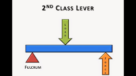

# POE Reference Sheet

## Anchor Links:
[First Class Lever](#first-class-levers)

[Second Class Lever](#second-class-levers)

[Third Class Lever](#third-class-levers)

## First Class Levers:

(_Formulas:_)

IMA=Length of effort arm divided by length of resistance arm-->Deffort/Dload

AMA=Force of resistance divided by force of effort-->Fload/Feffort

## Second Class Levers:

(_Formulas:_)

IMA=Effort distance divided by load distance-->Deffort/Dload

AMA=Force of resistance divided by force of effort-->Fresistance/Feffort

## Third Class Levers:
