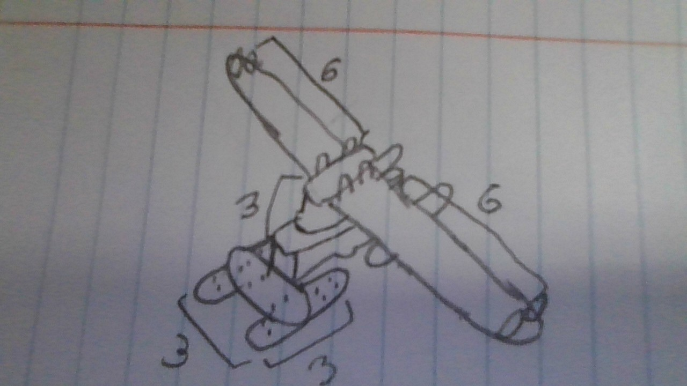

## About This Project
This website acts as a personal and public hub for those in engineering programs in middle or high school. I will be sharing my knowledge as I go through the next year of the program, Principles of Engineering, for reference.

## Topics and References Available
-Formulas

-Simple and complex machines

-Definitions

-Potentially structural analyses

-Pictures of completed projects

-etc.

## Anchor Links:
[First Class Lever](#first-class-levers)

# First Class Levers:

Above is an image of a complicated first class lever mechanism. As you can see, the effort force is applied on one side and the resistance force is applied on the other. The fulcrum is in the middle.
(_Formulas:_)
IMA=Length of effort arm divided by length of resistance arm-->Deffort/Dload
AMA=Force of resistance divided by force of effort-->Fload/Feffort
